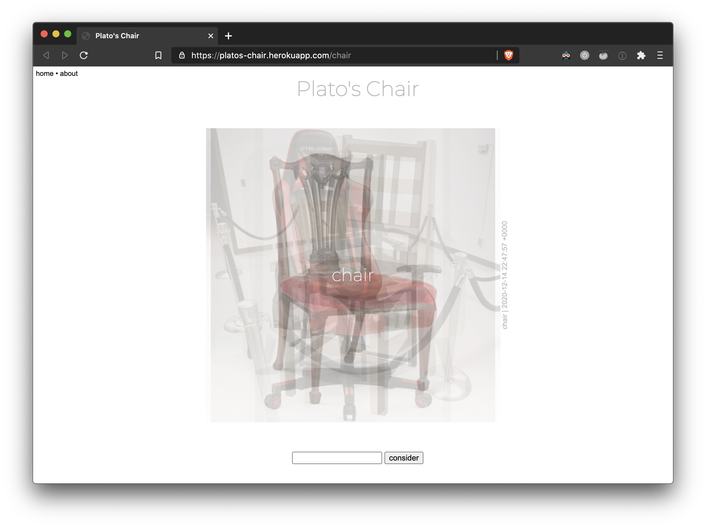
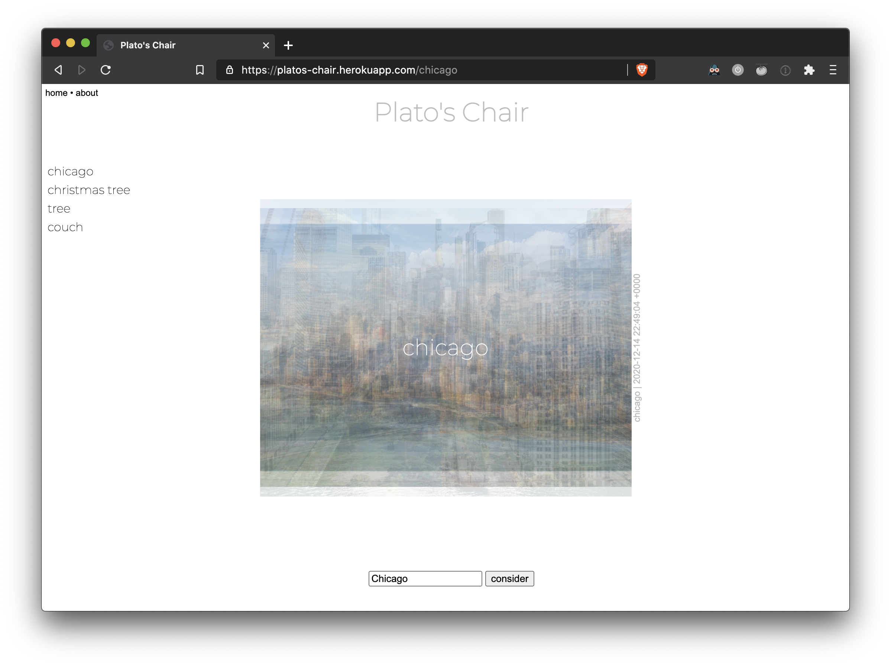

# Plato's Chair

* **Try is out:** [http://www.platoschair.com/](http://www.platoschair.com/)
* **Stack:** `Ruby`
* **Feedback:** [Will.Lotherington@hey.com](mailto:Will.Lotherington@hey.com)

### What is it?
Builds a composite image from the top 10 google images.

### Overview
* Built with a Ruby backend leveraging Google's image search API
* Allows you to enter a search term and see a composite of the top 10 google image results

### Why?
It is interesting how google search results vary over time and are different based on the user's brosing history, location data, and a host of other factors that I am not privy too. This project lets you see Google's current idea of what a specific object is relative to you as the viewer.

The name "Plato's Chair" came from the idea of Plato's theory of forms. I've always thought of his idea of essences as the probability cloud of all instances of the object that exists for us in reality. e.g. if you make a probability cloud of all chairs that exist, you get a decent idea of what the true essence of a chair is.

